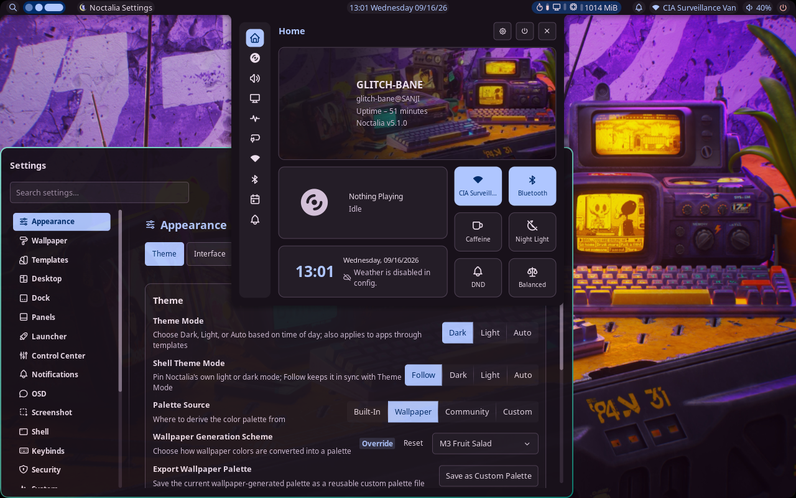

<h2 align=center>glitch-bane dotfiles<br>► ARCH ◄</h2>
<div align="center"><a href="#about">About</a> - <a href="#install">Install</a> - <a href="#usage">Usage</a> - <a href="#external-credit">Credit</a></div>
<hr/>

## About

This repository contains my personal dotfiles for configuring my flavor of Arch Linux. The setup uses Hyprland / Noctalia as the desktop environment (Wayland compositor) and is very minimal. My target machine is a `writer's terminal`, meaning very old hardware with the user's undistracted focus in mind. The goal of this configuration is to offer an easy and stylish provisioning agent for old thin-clients, which additionally utilizes bridge key-bindings/gestures similar to other operating systems.

- Linux Distro: **Arch-based Distributions**, *CachyOS*
- Wayland Compositor: **Hyprland**
- Desktop Shell: **Noctalia**
- Login Greeter: **TTY**



<br/>

## Install

> [!NOTE] 
> CachyOS, being a rolling distribution, is very prone to unprecedented changes. I maintain these configurations by crossing them with the official base configuration repository to observe canon changes.

**Installation Instructions:**

For a barebones CachyOS installation, this project makes a few assumptions:
- Base CachyOS installed, current ISO version at time of commit: `260809`
- The Hyprland desktop environment was selected
- The Noctalia Greeter / SDDM are all DESELECTED

<br/>

**Provisioning Instructions:**

This project uses **Bare GIT** to manage dotfiles and prevent symlinking issues. This also grants easy differentials against CachyOS' default configuration changes. Clone this repository in your home path's configuration directory `$HOME/.config` after making a backup (move existing directory to prevent conflicts, then migrate any specifics back). Lastly, run the provisioning script.

```
mv ~/.config ~/.config-bak
git clone https://github.com/glitch-bane/dotfiles.git ~/.config
cd ~/.config/.provisioners

chmod +x ./provisioner.sh
sudo ./provisioner.sh
```
<br/>

## Usage

**Custom Keybinds:** Keybinds are sourced in `~/.config/hypr/config/keybinds.lua`

- **Mod key**: Windows/Super Key
- **Change Focus**: `Mod + Directional Arrows`
- **Move Active Window**: `Mod + Shift + Directional Arrows`
- **Move Active Window to Workspace**: `Mod + Shift + 1|2|3`
- **Terminal**: `Mod + Return`
- **File Manager**: `Mod + e`
- *Reference Keybinds configuration for a full list...*

<br/>

**Trackpad Gestures:** Gestures are sourced in `~/.config/hypr/config/input.lua`

- **3 Finger Horizontal Swipe**: Change Workspace
- **3 Finger Downward Swipe**: Active Window Float
- **3 Finger Upward Swipe**: Active Window Fullscreen
- **4 Finger Horizontal Swipe**: Change Workspace
- **4 Finger Downward Swipe**: Open Alacritty Terminal
- **4 Finger Upward Swipe**: Open Launcher

<br/>

## External Credit

- Wallpaper is attributed to *hold for source*.
